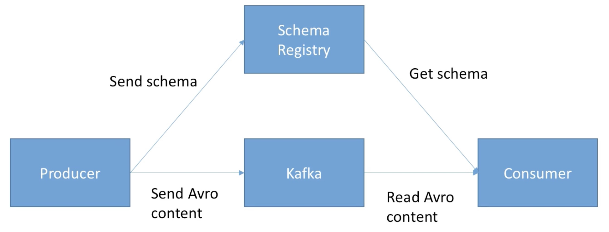

1. create a topic in kafka server

```
kafka-topics --create --bootstrap-server localhost:9092 --replication-factor 1 --partitions 3 --topic FIRST_TOPIC
```

2. create a consumer in kafka server
```
kafka-console-consumer --bootstrap-server localhost:9092 --topic FIRST_TOPIC --from-beginning
```

or 
```
docker exec -it kafka1 kafka-console-consumer --bootstrap-server 127.0.0.1:9092  --topic FIRST_TOPIC --from-beginning```


kafka-console-consumer --bootstrap-server localhost:9092 --topic FIRST_TOPIC --from-beginning
```


# Configurations


## producers

- `acks`
  - acks means acknowledgments.  
  - that there were three level for acks.
    - There was zero, one, and all.
      
  - `0` (no acks)
    - no response from the broker, means that if the broker is or goes offline or an exceptions happens we won't know and we will lose data.
    - good feet for example for:
      - Metrics Collection
      - Log collection
      - or any other not critical data
    
  - `1` (default)
    - leader acknowledgment, basically response is requested, but there is no guaranty of any replication.
    - Replication is something that happens in the background but is not prerequisite to receive a response.
    - If an ACK is not received the producer may retry.
    - If the leader broker goes offline but replicas haven't replicated the data yet, we have a data loss.
    
 - `all` (replicas acknowledgment)
    - The leader and the replicas ack requested
    - Add some latency and safety
    - **When we use `aks` equals to `all`, we need also to use another setting called `min.insync.replicas` .** 
    - `min.insync.replicas` can be set at broker or topic level (override)
    - The most common setting for `min.insync.replicas` is 2. That are ISR -  (including leader) must respond that they have the data.
      - That means if you use `replication-factor=3,min.insync.replicas=2,acks=all`, you can only tolerate 1 broker down, otherwise the producer will receive an exception on send.
    
- `Retries`
  -  In case of transient failure, developer are expected to handle exceptions, otherwise the data will be lost.
    - Example of transient failure
      - NotEnoughReplicasException
    - There is a `retries` setting
      - default to 0 for kafka <= 2.0 (no retries)
      - default to 2147483647 for kafka >= 2.1
    - the is also the setting `retry.backoff.ms` that by default is 100ms. means that every 100 milliseconds kafka producer will retry to send to kafka.
    - to not perform retries forever, exists also other setting `deivery.timeout.ms` by default  have the value 120_000ms == 2 minutes, means the producer will perform retries at maximumm in 2 minutes.
  - _Warning: when we use reties there is a chance that messages will be sent out of order. If you retry-based ordering, that can be an issue. For this, you an set the setting while controls how many produce requests can be made in parallel: `max.in.flight.request.per.connection` (default = 5) in this case we should set the value to 1 _
    

### Idempotent Producer

Problem: The producer can introduce duplicate messages in kafka due to network errors (for example).

```
producerProps.put("enable.idempotence", true);
```

## In Summary, A good Safe producer:

-  kafka < 0.11
  - acks=all (ensure data is properly replicated before an ack is received)
  - min.insync.replicas=2
  - reties=MAX_INT (producer level)
  - max.in.flight.request.per.connection=1 (options, only if the ordering is an issue, otherwise the value should be 5)

-  kafka >= 0.11
  - enable.idempotence=true (producer level) 
  - min.insync.replicas=2 (broker/topic level)


- if I want to have an extremely high confidence that leaders and replicas have my data, I should use
  - `acks=all, replication factor=3, min.insync.replicas=2`
---

# Configuring Producers and Consumers

### Client Configurations

- There exist a lot of options to:
    - configure producer: https://kafka.apache.org/documentation/#producerconfigs
    - configure consumers:  https://kafka.apache.org/documentation/#consumerconfigs

---

# Real World Exercise

- Real-World Exercise:
    - Before jumping to the next section for the solution, here are some pointers for some exercises:

- Twitter Producer
    - The Twitter Producer gets data from Twitter based on some keywords and put them in a Kafka topic of your choice
    - Twitter Java Client: [https://github.com/twitter/hbc](https://github.com/twitter/hbc)
    - Twitter API Credentials: [https://developer.twitter.com/](https://developer.twitter.com/)

- ElasticSearch Consumer
    - The ElasticSearch Consumer gets data from your twitter topic and inserts it into ElasticSearch
    - ElasticSearch Java
      Client: [https://www.elastic.co/guide/en/elasticsearch/client/java-rest/6.4/java-rest-high.html](https://www.elastic.co/guide/en/elasticsearch/client/java-rest/6.4/java-rest-high.html)

ElasticSearch setup:

- https://www.elastic.co/guide/en/elasticsearch/reference/current/setup.html
  OR
- https://bonsai.io/

---

```
API key: 
1z6RTU5M0DRsVAz0vhCoyyp3N

API secret key
pHxb6BuW7bCtUZ0kbUWtQmjly1I6JvSkdEwyCZdBbniYYwn431

Bearer token
AAAAAAAAAAAAAAAAAAAAAMzhKgEAAAAAXTOM25kXglBv4%2Bfmlu16TdsqKXc%3DkAMaj4fTbd6vo49VbeCFUlwiDpeCSreURppmhXOzhOiRTbULur
```

Twitter client dependency

```
https://github.com/twitter/hbc
 <dependency>
      <groupId>com.twitter</groupId>
      <artifactId>hbc-core</artifactId> <!-- or hbc-twitter4j -->
      <version>2.2.0</version> <!-- or whatever the latest version is -->
 </dependency>
```

## Message Compression

- Producer usually send data that is text-based, for example with JSON data.
- In this case, it is very important to apply compression to the producer.
- Compression is enabled at the producer level and doens't require any configuration change in the broker or in the consumers.
    - `compression.type` can be `none` (default), `gzip`, `lz4`, `snappy`
- Compression is more effective the bigger the batch of message being sent to kafka.

- Compression Advantages:
    1. Much smaller producer request size (compression ratio up to 4x!)
    2. Faster to transfer data over the network => less latency
    3. Better throughput
    4. Better disk utilization in kafka (stored messages on disk are smaller)
- Compression Disadvantages (very minor)
    1. Producer must commit some CPU cycles to compression
    2. Consumer must commit some CPU cycles to decompression
- Overall
    1. Consider testing snappy or lz4 optimal speed/compression ratio
    2. Gzip is going to have the highest compression ratio, but it's not very fast.
    3. Consider tweaking `linger.ms` and `batch.size` to have bigger batches, and therefore more compression and higher throughput
    - `linger.ms`: Number of milliseconds a producer is willing to wait before sending a batch out (default 0). That means that the producer should send the data through kafka right away.
        - By introducing some lag (for example `linger.ms=5`), we increase the chances of messages being sent together in a batch.
        - So at the expense of introducing a small delay, we can increase throughput, compression and efficiency of our producer.
    - `batch.size`: Maximum number of bytes that will be included in a batch. The default is 16K
        - If a batch is full before the end of the linger.ms period, it will be sent to kafka right way
        - Increasing the batch.size to something like 32Kb or 64Kb can help increasing the compression, throughout, and efficiency of requests.
        - Any message that is bigger that the batch size will not be batched.
        - A batch is allocated per partition, so make sure that you don't set it to a number that is tool high, otherwise you will run waste memory.
        - _Note: You can monitor the average batch size metric using kafka Producer metrics_


## Producer Default Partitions and how keys are hashed

- The keys, using a serializer, they are converted into bytes, a serie of zeros and ones. These bytes are going to get hashed. Hashed is basically a big, mathematical formula to basically, transform all these numbers into a final value.
- By default kafka hashed the keys using the "murmum2" algarithm.

    -  The formula is: `targetPartition = Util.abs(Utils.murmum2(record.key())) % numPartitions;`
    - **This means that same key will go to the same partition, and adding partitions to a topic will completely alter the formula.**

- Note: It is most likely preferred to not override the behavior of the partitioner but it is possible to do so (partitioner.class)


## `Max.block.ms` & `buffer.memory`

- these two settings are called max block millisecond and buffer memory, and they are super advanced, they are usedonly when you run into these exceptions that you really need to look into those.

_- As a beginner level, don't even look at these things, unless to get the exception we're going to visit right now._

- basically the exception happens when the producer produces way faster than the broker can take. And, so, basically the broker can not ingest data fast enough.

- The records are going to be buffered in the producer memory. By default each producer has a buffer memory of 32 megabytes, that is the size of the send buffer.
    - `buffer.memory=22554432 (32MB) `
    - The buffer will fill up over time and fill back down when the throughput to the broker increases. If the buffer if full (all 32MB), then the `.send()` method will start to block (won't return right away). Basically, that means that your code won't try to produce more data, it will just wait. That wait is controlled by max block milliseconds configurations:
    - `max.block.ms=60000` is the time the send method execution will block until throwing an exception. Exceptions are basically thrown when:
        - The producer has filled up its buffer.
        - The broker is not accepting any new data.
        - 60 seconds has elapsed.
    - If you hit an exception hit that usually means your broker are down or overloaded as they can't respond to requests.


## Delivery Semantics in the consumers

 For most applications you should use **At Least Once** processing  

- **At Most Once**
  - At most once offsets are committed as soon as the message batch is received.
  - If the processing goes wrong, the message will be lost (it won't be read again).
    - For example, if the consumer processor have to persist the data in some king of repository, and during the processor any exceptions happens, then the data will be lost, but the kafka record offset has successfully committed because that happens before the processor operations.

- **At Least once**
  - This default behavior.
  - Offsets are commit after the message is processed.
  - if the processing goes wrong, the message will be read again.
  - This can result in duplicate processing of messages. we should make sure that your processing is **idempotent** (i.e. processing again the message won't impact our system)
  -
    
- **Exactly once**
  -  can be achieved for kafka 0> kafka workflows using kafka Stream API. For Kafka => Sink workflows, use an idempotent consumer.


#### implements At Least once

The main question is: how to make our consumer idempotent insuring that we can handler the duplicate processing? 

- The consumer must be idempotent:
  - We can use Kafka Generic ID
    ```java
    ConsumerRecord cr = ...
    String id = cr.topic() + "_" + cr.partition() + "_" + cr.offset();
    ```
  - In a better alternative we can find and use a business id.


## Consumer Pool Behavior

- kafka consumer have a poll model (means that basically the consumers will ask data from kafka), while many other messaging bus in enterprises have a push model (means that broker server send the data to the consumers, while the consumer just await).

- The kafka behavior allows consumers to control where in the log they want to consume, how fast, and gives them the ability to replay events.

- The kafka behavior can be controlled in many different ways:

  1. `Fetch.min.bytes` (default 1)
    - define how many bytes in minimum you want.
    - This allows to  control how much data you want to pull at least on each poll request.
    - CONTRA: More latency
    
  2. `Max.poll.records` (default 500)
    - Control how many records to receive per poll request
    - Increase if your messages are very small and have a lot of available RAM
    - Good to monitor how many records are polled per request
    
  3. `Max.partitions.fetch.bytes` (default 1MB)
    - Maximum data returned by the broker per partition
    - For Example: If you read 100 partions, you'will need a lot of memory (RAM), because you need to allocate a lotes of data in RAM.

  3. `Fetch.max.bytes` (default 500MB)
    - Maximum data returned from each fetch request (covers multiple partitions)
    - Basically, the consumer performs multiple fetchs in parallel.
    
- All the previous settings are the defaults, and you should only change it if o really need it and know exactlly what you are doing.


## Consumer Offset commits Strategies

Normally we don't have to worry about this setting the default is the perfect behavior for mostly all the situations.

There are two most common patterns for committing offset in a consumer application:

1. `enable.auto.commit = true` & synchronous processing of batches
  - default behavior
  - The Pull is only executed after all the previous messages have been processed.
  - with auto-commit offset will be committed automatically for you at regular interval (`auto.commit.interval.ms=5000` by default) every-time you call .poll()

2. `enable.auto.commit = false` & manual commit of offsets
    ```
    LOGGER.info("Committing the Offsets...");
    kafkaConsumer.commitSync();
    LOGGER.info("Offsets have been committed...");
    ```
   
   - Now after some execution we can check the state of the consumer group:
     ```shell
      kafka-consumer-groups --bootstrap-server localhost:9092 --group KafkaConsumerElasticsearchDispatcher --describe
     ``
     

## Consumer Offset Reset Behaviour

-  The behavior for the consumer is one of the following:

  1. auto.offset.reset=latest
    - will read from the end of the log 
  2. auto.offset.reset=earliest
    - will read from the start of the log
    
    ```
      kafka-consumer-groups --bootstrap-server localhost:9092 --group KafkaConsumerElasticsearchDispatcher --reset-offsets --topic twitter_tweets --to-earliest --execute
      
      kafka-consumer-groups --bootstrap-server localhost:9092 --group KafkaConsumerElasticsearchDispatcher --describe
    ```     

  3. auto.offset.reset=note
    - will throw exception if no offset is found


# Kafka Connect

- Do you feel you are not the first person in the word to write a way to get data out of twitter?
- Do you feel yoy are not the first person in the word to send data from kafka to PostgresSQL /  Elastisearch / MongoDb?
- Additionally, the bugs you will have, won't some have fixed them already? 

- **Kafka connect is all about code & connectors re-use!**

- [https://www.confluent.io/hub](https://www.confluent.io/hub)
- [https://docs.confluent.io/home/connect/kafka_connectors.html](https://docs.confluent.io/home/connect/kafka_connectors.html)
- [Kafka connector documentation](https://docs.confluent.io/cloud/current/connectors/index.html)

---
# Kafka Stream API

Imagine the following Scenario.

>- You want to do the following from the one specific topic:
>  1. filter only the records that have some predicate.
>  2. Count the number of records for some predicate.
>- Or combine the two to get trending topics and hashtags in real time!

- With Kafka Producer and Consumer, you can achieve that, but it's very low level and not developer friendly. This is why kafka Streams came in.

- Kafka Streams is Java Library, that allows easy data processing and transformations within Kafka.

- The idea is that kafka stream is a standard Java application, there is no cluster to run it on. You don't need to create a separate architecture for it.

  - Standard Java Application
  - No need to create a separate cluster
  - Highly scalable, elastic and fault tolerant
  - Exactly Once Capabilities
  - One record at a time processing (no batching)
  - Works for any application size
    
- It is a serious contender to other processing frameworks such as Apache Spark, Flink, or NiFi.


- Our problem is the following:
 1. We basically want to chain a Consumer with a Producer.

Tweets_Topic --> Consumer --> Application Logic --> Producer --> Filtered_Topic

- We can implement the flow as follows:

```java
import com.google.gson.JsonParser;
import org.apache.kafka.common.serialization.Serdes;
import org.apache.kafka.streams.KafkaStreams;
import org.apache.kafka.streams.StreamsBuilder;
import org.apache.kafka.streams.StreamsConfig;
import org.apache.kafka.streams.kstream.KStream;

import java.util.Properties;

/**
 * Stream Filter Tweets
 *
 * <pre>
 *     kafka-topics --zookeeper zoo1:2181 --topic twitter_tweets --create --partitions 4 --replication-factor 1
 *     kafka-topics --zookeeper zoo1:2181 --topic important_tweets --create --partitions 3 --replication-factor 1
 * </pre>
 */
public class Application {

    private static final JsonParser jsonParser = new JsonParser();

    public static void main(String[] args) {
        //
        // Create properties
        Properties properties = new Properties();
        properties.setProperty(StreamsConfig.BOOTSTRAP_SERVERS_CONFIG, "localhost:9092");
        /* the consumer group using stream is called the application */
        properties.setProperty(StreamsConfig.APPLICATION_ID_CONFIG, "demo-kafka-streams");
        /* define the serializers */
        properties.setProperty(StreamsConfig.DEFAULT_KEY_SERDE_CLASS_CONFIG, Serdes.StringSerde.class.getName());
        properties.setProperty(StreamsConfig.DEFAULT_VALUE_SERDE_CLASS_CONFIG, Serdes.StringSerde.class.getName());


        //
        // Create a topology
        StreamsBuilder streamsBuilder = new StreamsBuilder();

        KStream<String, String> inputTopic = streamsBuilder.stream("twitter_tweets");
        KStream<String, String> filteredStream = inputTopic.filter((k, jsonText) -> extractUserFollowersInTweet(jsonText) > 10_000);
        filteredStream.to("important_tweets");

        //
        // build the topology
        KafkaStreams kafkaStreams = new KafkaStreams(streamsBuilder.build(), properties);

        //
        // start out stream application
        kafkaStreams.start();
    }

    private static int extractUserFollowersInTweet(String tweetJson) {
        try {
        
            // using gson
            return JsonParser.parseString(tweetJson)
                    .getAsJsonObject()
                    .get("user")
                    .getAsJsonObject()
                    .get("followers_count")
                    .getAsInt();

        } catch (NullPointerException e) {
            return 0;
        }
    }
}
```

```xml
<dependency>
    <groupId>org.apache.kafka</groupId>
    <artifactId>kafka-streams</artifactId>
    <version>2.6.0</version>
</dependency>
```

---
# Kafka Schema Registry

- kafka take bytes as an input and publishes them.
- No data verification.

- Questions:
  - what if the producer sends bad data?
  - what if a field gets renamed?
  - what if the data format changes from one day to another?

- Answer:
  - The Consumers breaks!!!

- To solve those problems, we need have a Schema Registry.

- Thankfully, there are two ways we could do this:

  - The Schema registry has to be a separate components
  - Producers and Consumers need to be able to  talk to it
  - The Schema Registry must be able to reject bad data
    - It needs to support schemas
    - It needs to support evolution
    - It needs to be lightweight
  - Thankfully all these things exists already and Confluent, the creators of kafka have created something called the **confluent schema registry.**
    - And they choice **`Apache Avro`** as the data format 
    

  

1. We have Kafka and the schema registry.
2. Our producer will send Avro content to Kafka, and he will send the schema to the schema registry.
3. Finally, Our consumers will get the schema from the schema registry, and read Avro content.

#### Gotchas

- Utilizing a schema registry has a lot of benefits
- But it implies you need to
  - Set it up Well
  - Make sure it's highly available
  - Partiallly change the producer and consumer code
- Apache Avro as a format is awesome  but has a learning curve
- The Schema registry is free and open sourced, created by Confluent.
- As It takes time to setup.

TODO: need to example how to setup the Schema registry.


# Partitions Count, Replication Factor

- Each partition can handle a throughput of new few MB/s
- More partitions implies:
  - Better parallelism
  - Ability to run more consumers in a group to scale
    - I.E. If we have 3 partitions we are limited to have maximum of 3 consumers in a group. A 4 consumer would be just be inactive.
  - Ability to leverage more brokers if you have a large cluster.
    - More partitions you have, the more brokers you will utilize.
    - So, if you have a large cluster of 20 brokers and you create a topic with two partitions, then you only have two brokers working for you.
  - BUT more partitions you have more elections that zookeeper will perform for you.
    

### Guidelines:

**- Partitions per topic = MILLION DOLLAR QUESTION**
  1. If You have a small cluster (less that 6 brokers) => Nº partitions should be 2X the number of brokers.
    -  nº broker < 6  then 2 * nº brokers
     
  2. If you have a Big cluster (> 12 brokers) => Nº partitions should be 1x the nº brokers
    - nº broker > 12 then 1 * nº broker 

**- Replication Factor**
  1. Should be at least 2, usually 3, maximum 4
  2. The higher the replication factor (N)
    - Better resilience of your system (N-1 brokers can fail)
    - BUT more replication (higher latency if acks = all)
    - BUT more disk space on you system (50% more if RF is 3 instead of 2)
  
  3. We should start with 3 (you must have at least 3 brokers for that)
  4. If replication performance is an issue, we should get a better instead of less RF (better machines).
  5 Never set it to 1 in production
     

- A broker should not hold more than 2_000 to 4_000 partition (across all topics of that broker).
- Additionally, a kafka cluster should have a maximum of 20_000 partions across all brokers.


---

# Log Cleanup Policies

- Most Kafka clusters make data expire, acording to a policy. That concept of making data expire is called Log-Cleanup:
- There are More than one Policy:

1. Policy 1: **`log.cleanup.policy=delete`** (kafka default for all user topics)
  - The data is delete based on its age (default is one week)
  - The data is also deleted based on max size of log (default is -1 == infinite)

2. Policy 2: **`log.cleanup.policy=compact`** (kafka default for topic __consumer_offsets)
  - If we run the following command:
    ```
    kafka-topics --zookeeper 127.0.0.1 --decribe __consumer_offsets
    ```
  - we can see that in the output there is one configuration called log.cleanup.policy and its have the value compact
    - Delete based on key of the messages
    - Delete old duplicate keys **after** the active segmente is commited.
    

### Log Cleanup Policy: Delete

- the first relevant configuration is `log.retention.hours`, it means the number of hours thar the data should be keeped, 168 hours by default (equivalent to one week).
  - keep in mind:
    - if we put one Higher number, means we will use more disk space, but we will have more data.
    - If we put one lower number, means we will have less data retained, and that can be a problem if your consumers are down for too long and when they came back up, they can miss data.
    
- the second relevant configuration `log.retention.bytes`, it means the Max size in Bytes for each partition (default is -1 that means infinite) but you may want to for example keep the size of the log under a threshold.

### Log Cleanup Policy: Compact

- ensure that your log contains at least the last known value for a specific key within a partition.
- very usefull if we just require a SNAPSHOT instead of full history (such as for a data table in a database). The idea is that we wanna keep in kafka only the latest update for a key in our log. 
- Means that we basically want to keep just the most recent information.